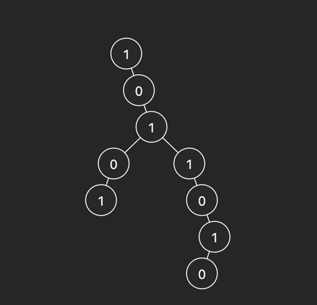
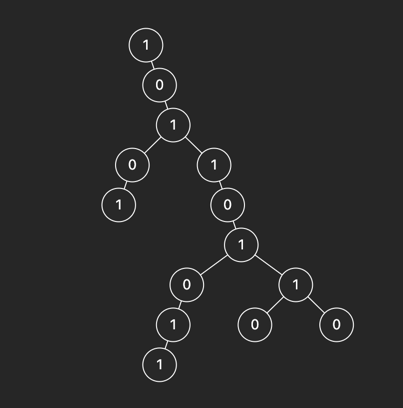

w# This is an external problem.

# Get number of numbers of islands

# Example 1

input: `head = [1, null, 0, null, 1, 0, 1, 1, null, null, 0, null, null, null, 1, 0]`

output: `4`

This example has 4 islands

# Example 2

input: `head = [1, null, 0, null, 1, 0, 1, 1, null, null, 0, null, null, null, 1, 0, 1, 1, null, 0, 0, 1]`

output: `5`